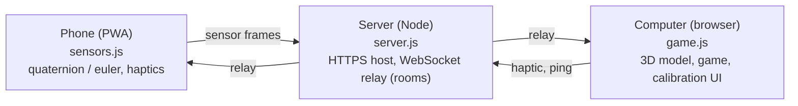

# MotionCast

**Turn your phone into a real-time motion source for any computer.**

Open a web page on your phone, and its orientation, accelerometer/gyroscope, and
haptics stream live to your computer over a local HTTPS + WebSocket link. No app
store, no native build, no SDK. It installs as a PWA and works on the same Wi-Fi.

MotionCast is a foundation for anything motion-driven: controllers, remotes,
games, gesture tools, visualizers. It ships with a gimbal-free 3D model that
mirrors your phone's real pose, and a small demo game, Tilt Arena, so you can see
the sensor stream working in seconds.

[](LICENSE)
&nbsp;Node 18+ · zero frontend frameworks

<!-- Add a demo GIF here once recorded:  -->

## Quick start

```bash
npm install
npm start
```

1. **Computer:** open `https://localhost:8443/` (the receiver) and accept the
   self-signed certificate warning.
2. **Phone** (same Wi-Fi): scan the QR code shown on that page, or open the
   `https://<your-lan-ip>:8443/phone` URL the start command prints. Accept the
   cert warning, tap **Start sensors**, and tilt.

That's it. Tilt your phone and watch the 3D model and the demo track it live.

> Add `?room=name` to both URLs to run several independent sessions at once.

## Features

- **Live 3D orientation.** A 3D phone model mirrors your device's real pose in
  real time.
- **Gimbal-lock free.** Uses the Generic Sensor API quaternion where available
  (Android/Chrome), with a `deviceorientation` Euler fallback (iOS/Safari).
- **Auto-calibration per device.** The two sensor APIs use different axis
  conventions, so MotionCast detects the source and applies a matching profile
  (axis mapping, inverts, trims) automatically.
- **Calibrate from anywhere.** A guided setup wizard, fine-tune sliders, and a
  one-tap calibrate-front on both the phone and the computer.
- **Two-way haptics.** The computer can buzz the phone, and the phone buzzes on
  in-game events.
- **Scan to connect.** A locally generated QR code joins a phone instantly,
  without typing IP addresses, plus a live readout of stream rate and latency.
- **Installable PWA.** Offline-capable shell, no app store.

## How it works



- **Transport.** An Express server serves the PWA over HTTPS and runs a WebSocket
  relay. Clients join a room; phones broadcast sensor frames to computers, and
  computers send haptic commands back.
- **Orientation.** Device orientation is handled as quaternions to avoid gimbal
  lock. Calibration is a relative rotation, smoothed and rendered with a CSS
  `matrix3d` transform that maps the device axes to the screen.
- **Open protocol.** The WebSocket message format is documented in
  [`docs/PROTOCOL.md`](docs/PROTOCOL.md), which is enough to write your own client.

### Why HTTPS?

Browser motion sensors only work in a secure context, and a LAN IP over plain
`http://` does not qualify. The server runs HTTPS with a self-signed certificate
generated automatically into `.cert/` on first run.

## Calibration

- **Calibrate front.** Hold the phone how you want "straight ahead," then tap
  (on the phone or the computer).
- **Guided setup.** Confirms each axis (pitch, yaw, roll) one at a time.
- **Fine-tuning.** Per-axis invert toggles, a roll/yaw swap, and trim sliders,
  all under *Advanced*.
- **Export / import.** Save a known-good profile to JSON and reload it. A baseline
  for iPhone and Android is included in `known-good-settings.json`.

## Project structure

| Path | Purpose |
| --- | --- |
| `server.js` | HTTPS static host + WebSocket relay |
| `public/index.html`, `public/sensors.js` | Phone controller (PWA) |
| `public/laptop.html`, `public/game.js` | Receiver: 3D model, calibration UI, Tilt Arena |
| `public/style.css` | Styles |
| `public/manifest.webmanifest`, `public/sw.js`, `public/icon*.svg` | PWA install assets |
| `docs/PROTOCOL.md` | WebSocket message reference |
| `known-good-settings.json` | Importable calibration baseline (iPhone + Android) |

## Roadmap

The sensor stream is the hard part, and it's done. Things to build on it:

- A native bridge that maps motion to real mouse/keyboard input (air-mouse,
  presentation remote, accessibility input).
- Gesture recognition from rotation rate and acceleration (flick, shake, chop).
- Recording and playback of sensor sessions for analysis or ML datasets.
- Multiplayer (multiple phones in one room) and more demos.
- Public deployment on a WebSocket-friendly host for use beyond the LAN.

## Contributing

Contributions are welcome. See [CONTRIBUTING.md](CONTRIBUTING.md) for setup and
guidelines. The project is intentionally dependency-light and framework-free.

## License

[MIT](LICENSE) © civarry
